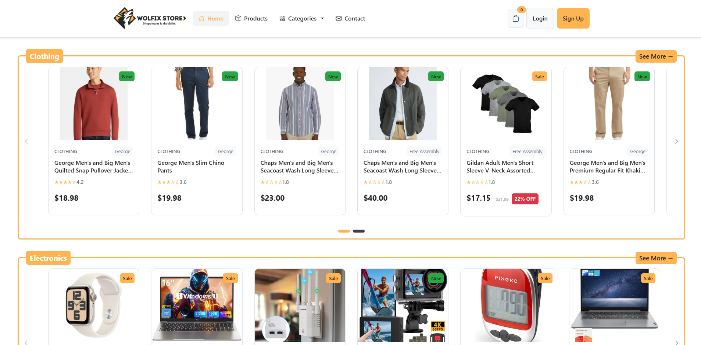
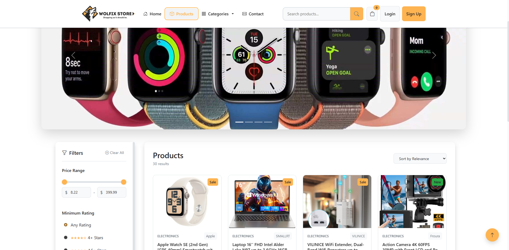
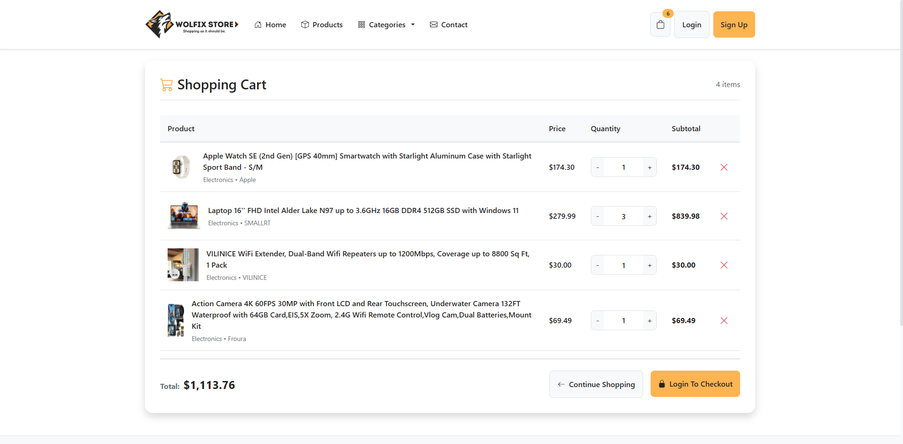
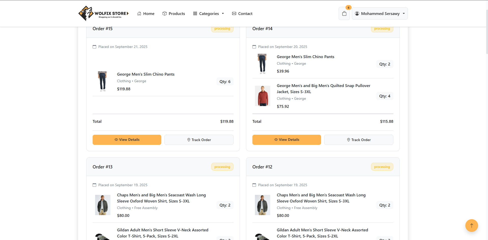
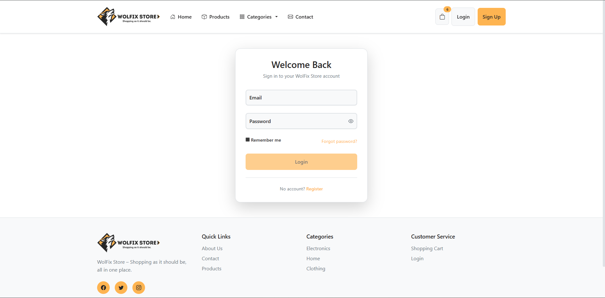

# 🛒 WolFix Store (Angular 20)

WolFix Store is a **responsive e-commerce web application** built with **Angular 20**, designed to deliver a seamless and intuitive shopping experience for electronics enthusiasts.

This project is a refactored version of my earlier vanilla JavaScript project, rebuilt with Angular to take advantage of its **component-driven architecture, routing system, and ecosystem libraries**.

---

## 🚀 Live Demo

👉 [Try WolFix Store Live](https://wolfixstore-ng.demo.sersawy.com/)

## 📂 Repository

👉 [GitHub Repo](https://github.com/sersawy/WolFix-Store-Angular-Ecommerce-Project)

---

## ✨ Features

- 🔍 **Instant Search & Advanced Filters** – Quickly find products with real-time filtering.
- 🛒 **Interactive Shopping Cart** – Add, remove, and update product quantities seamlessly.
- 🔐 **Authentication System** – User login, signup, JWT-based auth, and profile settings.
- 📦 **Orders Management** – View past orders and detailed order history.
- ✅ **Robust Validation System** – Angular forms + custom validators.
- 📱 **Responsive Design** – Optimized for desktop, tablet, and mobile.
- ⚡ **Reusable Components** – Built with Angular best practices (components, services, pipes, guards).

---

## 🛠️ Tech Stack

- **Framework:** Angular 20
- **Styling & UI:** Bootstrap 5, Bootstrap Icons, FontAwesome, PrimeNG
- **State Handling:** Angular Services + LocalStorage
- **Routing & Guards:** Angular Router with `authGuard` & `guestGuard`
- **Validation:** Angular Reactive Forms + Custom Validators
- **Notifications & UX:** ngx-toastr, ngx-spinner, ngx-mask
- **Build & Deploy:** Angular CLI + angular-cli-ghpages

---

## 📦 Dependencies

```json
"@angular/animations": "^20.2.4",
"@angular/common": "^20.2.0",
"@angular/compiler": "^20.2.0",
"@angular/core": "^20.2.0",
"@angular/forms": "^20.2.0",
"@angular/platform-browser": "^20.2.0",
"@angular/router": "^20.2.0",
"@fortawesome/fontawesome-free": "^7.0.1",
"@ng-bootstrap/ng-bootstrap": "^19.0.1",
"@popperjs/core": "^2.11.8",
"@primeuix/themes": "^1.2.3",
"bootstrap": "^5.3.8",
"bootstrap-icons": "^1.13.1",
"jwt-decode": "^4.0.0",
"ngx-mask": "^20.0.3",
"ngx-spinner": "^19.0.0",
"ngx-toastr": "^19.0.0",
"primeicons": "^7.0.0",
"primeng": "^20.1.1",
"rxjs": "~7.8.0",
"zone.js": "~0.15.0"
```

---

## 📂 Project Structure

```
src/app
│── components/         # Reusable UI components (buttons, product cards, etc.)
│── constants/          # Constants & API URLs
│── directives/         # Custom directives
│── guards/             # Route guards (auth & guest)
│── interceptors/       # HTTP interceptors (JWT handling)
│── models/             # Interfaces & models
│── pages/              # Application pages (home, cart, checkout, etc.)
│── pipes/              # Custom pipes (e.g., rating stars)
│── services/           # Business logic & API services
│   └── validators/     # Custom form validators
```

---

## ⚙️ Installation & Setup

1. **Clone the repository**

   ```bash
   git clone https://github.com/sersawy/WolFix-Store-Angular-Ecommerce-Project.git
   cd WolFix-Store-Angular-Ecommerce-Project
   ```

2. **Install dependencies**

   ```bash
   npm install
   ```

3. **Run the app locally**

   ```bash
   ng serve -o
   ```

   The app will be running at:  
   👉 `http://localhost:4200/`

---

## 📸 Screenshots

### 🏠 Home Page



### 🔍 Products Page



### 🛒 Shopping Cart



### 📦 Orders



### 🔐 Login & Signup



---

## 🎯 Learning Outcomes

- Practiced **Angular component-driven architecture**.
- Implemented **route guards, interceptors, and custom validators**.
- Improved **state management using services + LocalStorage**.
- Built **scalable and reusable UI components**.
- Migrated an existing **JavaScript project → Angular**.

---

## 👨‍💻 Author

**Mohammed Sersawy**  
📌 Frontend Developer | Passionate about Angular & Modern Web Development  
🔗 [LinkedIn](https://www.linkedin.com/in/msersawy/)

---

## 🏷️ Tags

`#Angular` `#FrontendDevelopment` `#JavaScript` `#WebDevelopment` `#Bootstrap` `#HTML5` `#CSS3` `#Ecommerce`
